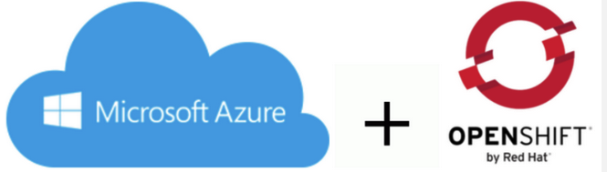

# Openshift 4 Azure IPI installation

Ansible Repository for deploy Openshift 4 clusters with IPI installation in connected, private and disconnected mode

There are different approaches for each mode, but always an IPI installation is used.

## 1. Prereqs

* [Prerequisites for Launch Automatic Installation](/docs/prereqs.md)

* [Prerequisites for Private / Disconnected Installation](/docs/prereqs-restricted.md)

## 2. Installation Modes

* [Connected Installation](/docs/mode-connected.md)
* [Private Installation](/docs/mode-private.md)
* [Disconnected Installation](/docs/mode-disconnected.md)

## 3. Egress/Outbound modes

### 3.1 Connected/Public Openshift cluster Egress/Outbound mode

By default in the Connected/Public Clusters the Egress / Outbound connections to Internet is
performed using the LoadBalancer Egress mode:

* [Default with LoadBalancer](/docs/egress-default.md)

### 3.2 Private/Restricted Openshift cluster Egress/Outbound mode

By default in the Private / Public Clusters the OutboundType is LoadBalancer, but other
possibilities can be used for the Egress/Outbound mode

* [Default with LoadBalancer](/docs/egress-default.md)
* [Proxy in Bastion Host](/docs/egress-proxy.md)
* [Azure Firewall](/docs/egress-firewall.md)
* [Nat Gateway](/docs/egress-nat.md)

### 3.3 Disconnected/Air Gapped Openshift Cluster Egress/Outbound mode (ongoing)

By default NO egress/outbound is allowed to Internet because is a Disconnected environment

* [Disconnected Egress](/docs/egress-disconnected.md)

## 4. Ingress Modes

* [Ingress in Public/Connected Mode](/docs/ingress-connected.md)
* [Ingress in Private Mode](/docs/ingress-private.md)
* [Ingress in Disconnected Mode](/docs/ingress-disconnected.md)

## 5. Platforms Tested

* Tested from Fedora33 with Ansible 2.9.18 and python 3.6
* Openshift 4.6.x and Openshift 4.7.x
* Latest Tested - 4.7.2
