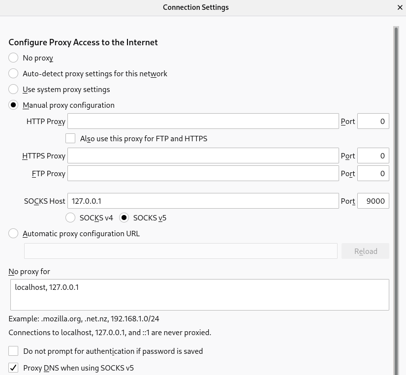

## Connect to a private cluster

* Connect to the bastion using the private key generated

```
ssh -i vault/ssh-key  -D 9000 az-admin@52.170.198.248
Activate the web console with: systemctl enable --now cockpit.socket

Last login: Wed Jan 20 18:19:06 2021 from 77.228.91.197
[az-admin@bastion ~]$ sudo -i
```

* And then connect using the Proxy Socks with the DNS option enabled. An example with Firefox is:


