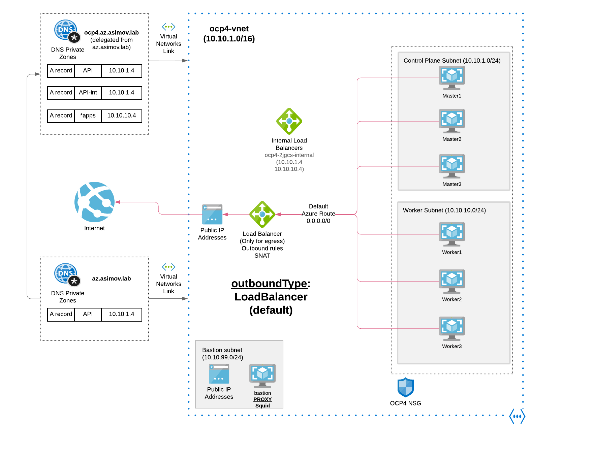

# Egress Default - Load Balancer

## 1 Install and Configure Azure with Load Balancer as Egress Outbound

```
ansible-playbook install-private.yml -e "egress=Loadbalancer" -e "azure_outboundtype=Loadbalancer" --vault-password-file .vault-file-password
```

## 1.2 Connect to the Private Cluster

* [Connect to the Private Cluster](/docs/connect-private-cluster.md)

## 2. Diagram Openshift Install using the Azure Load Balancer Outbound


