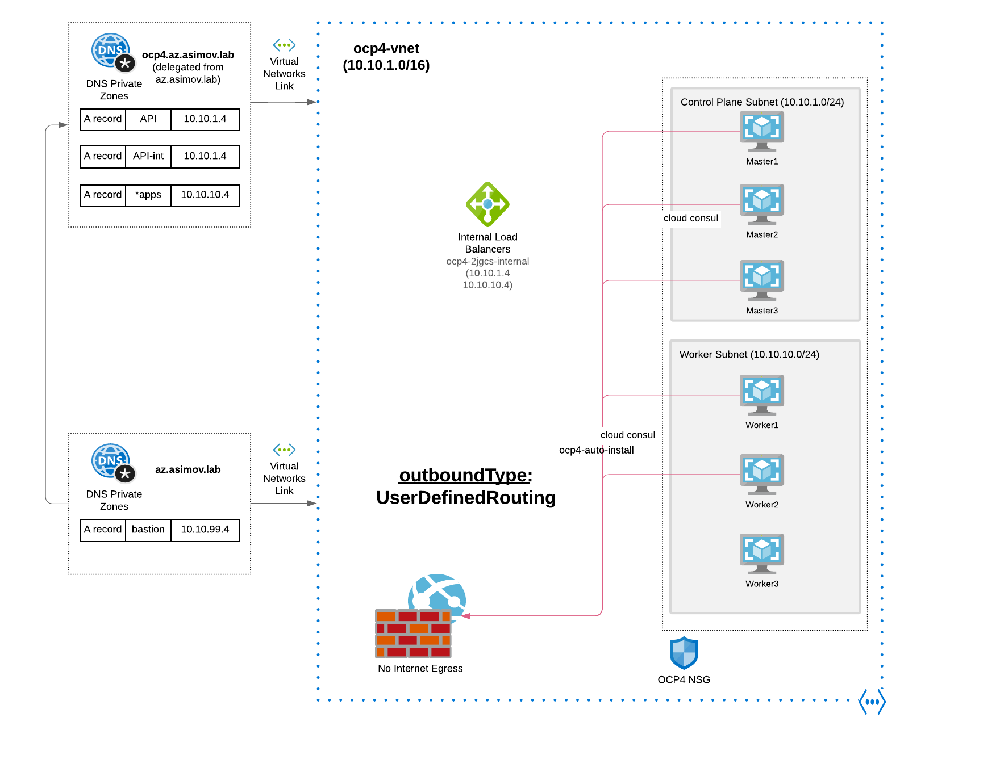

# Openshift 4 Egress in Disconnected Mode

## Openshift IPI Mode

Not Full AirGapped is possible with IPI mode.

The issue is that inside of the VNet, the
Machine-Config-Operator is not able to reach the API of the Azure Resource Manager through an
internal IP or DNS, because it's ONLY available in a Public IP / DNS resolution.

To be Documented

## Openshift UPI Mode

 

* NOTE: No MachineSet are allowed in this mode. The issue is that inside of the VNet, the
  Machine-Config-Operator is not able to reach the API of the Azure Resource Manager through an
  internal IP or DNS, because it's ONLY available in a Public IP / DNS resolution.

  Not a [Virtual Private Endpoint](https://docs.microsoft.com/en-us/azure/virtual-network/virtual-network-service-endpoints-overview) is available for this internal VNET <-> Azure Resource Manager
  connection
