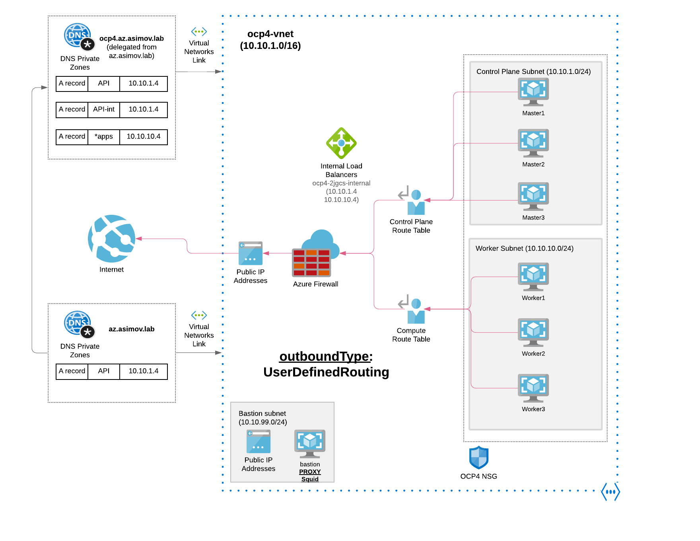

# Egress Mode - Azure Firewall

## Outbound Type - User Defined Routing - Azure Firewall

The simplest solution to securing outbound addresses lies in use of a firewall device that can control outbound traffic based on domain names. Azure Firewall, for example, can restrict outbound HTTP and HTTPS traffic based on the FQDN of the destination. You can also configure your preferred firewall and security rules to allow these required ports and addresses.

IMPORTANT: Outbound type of UDR requires there is a route for 0.0.0.0/0 and next hop destination of NVA (Network Virtual Appliance) in the route table. The route table already has a default 0.0.0.0/0 to Internet, without a Public IP to SNAT just adding this route will not provide you egress.

When using an outbound type of UDR, a load balancer public IP address for inbound requests is not created unless a service of type loadbalancer is configured. A public IP address for outbound requests is never created by AKS if an outbound type of UDR is set.

## 1. Install Openshift with Azure Firewall as the Egress Outbound

```
ansible-playbook install-private.yml -e "egress=firewall" --vault-password-file .vault-file-password
```

For more information check the [Official Openshift 4 installation in
Azure](https://docs.openshift.com/container-platform/4.6/installing/installing_azure/installing-azure-private.html#installation-azure-user-defined-routing_installing-azure-private).

## 1.2 Checking the Azure Firewall

* [Check Firewall](/docs/check_firewall.md)

## 1.3 Connect to the Private Cluster

* [Connect to the Private Cluster](/docs/connect-private-cluster.md)

## 2. Diagram Openshift Install using the Azure Firewall Outbound



The following items are not required or created when you install a private cluster:

* A BaseDomainResourceGroup, since the cluster does not create public records
* Public IP addresses
* Public DNS records
* Public endpoints
