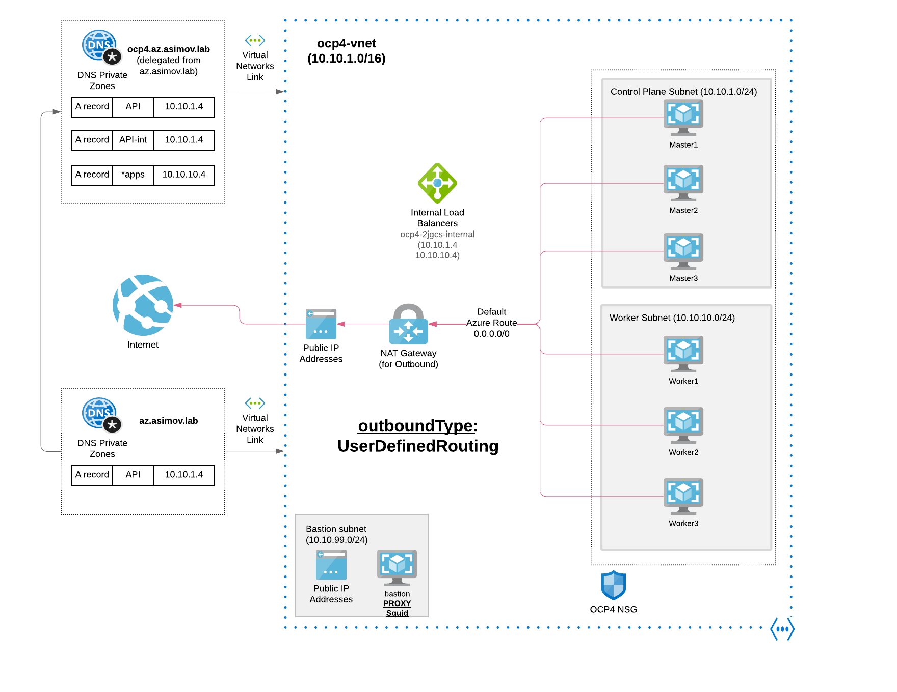

# Egress Nat

## 1 Install and Configure Azure with Nat Gateway as Egress Outbound

```
ansible-playbook install-private.yml -e "egress=natgateway" -e "azure_outboundtype=UserDefinedRouting" --vault-password-file .vault-file-password
```

## 1.2 Checking the Azure Firewall

* [Check Firewall](/docs/check_firewall.md)

## 1.3 Connect to the Private Cluster

* [Connect to the Private Cluster](/docs/connect-private-cluster.md)

## 2. Diagram Openshift Install using the Azure Nat Gateway Outbound



The following items are not required or created when you install a private cluster:

* A BaseDomainResourceGroup, since the cluster does not create public records
* Public IP addresses
* Public DNS records
* Public endpoints
