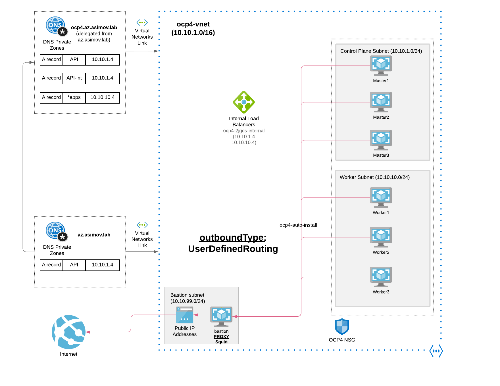

# Egress Mode - Azure Proxy

## 1 Install and Configure Azure Firewall with Ansible (recommended)

```
ansible-playbook install-private.yml -e "egress=proxy" --vault-password-file .vault-file-password
```

## 1.2 Checking the Azure Proxy connectivity

* [Check Firewall](/docs/check_firewall.md)

## 1.3 Connect to the Private Cluster

* [Connect to the Private Cluster](/docs/connect-private-cluster.md)

## 2. Diagram Openshift Install using the Azure Proxy Outbound


