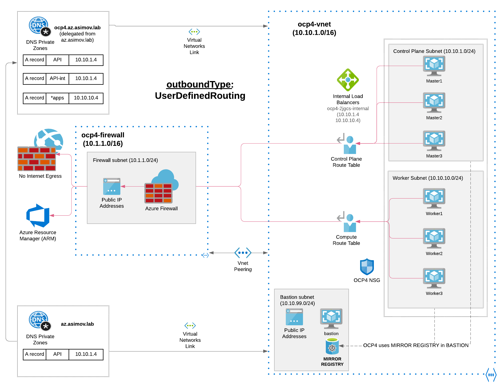

# IPI Installation - Mode Disconnected

This is the AirGapped mode with no public Internet connectivity from the cluster is allowed.
Mirrored Images in Bastion are needed and used for the installation of OpenShift Cluster as well as the several operators.

## Fill the vars

* Edit the vars-private.yml and customize to fill your needs:

```
vim vars/vars-disconnected.yml
```

## Execute the installation

```
ansible-playbook install-disconnected.yml --vault-password-file .vault-file-password
```

## Diagram for Disconnected Mode (Ongoing)

This is the possible scenario that supports full disconnected (and almost full airgapped) installation of OpenShift 4.



Not a [Virtual Private Endpoint](https://docs.microsoft.com/en-us/azure/virtual-network/virtual-network-service-endpoints-overview) is available for this internal VNET <-> Azure Resource Manager connection

For this reason a Azure Firewall, ONLY allowing the connections to Azure Resource Manager (but with the public DNS as management.azure.com) and denying the rest of the connections to Internet (or Quay.io)
Mirrored Images in the Bastion are used for this scenario, due to not external connectivity is allowed.

The following items are not required or created when you install a private cluster:

* A BaseDomainResourceGroup, since the cluster does not create public records
* Public IP addresses
* Public DNS records
* Public endpoints

## OutboundMode

OutboundMode is forced to be "User-Defined Outbound Routing"

```sh
outboundType: UserDefinedRouting
```

Mode Disconnected won't allow the Outbound Connectivity to Internet (only through the Azure Firewall to reach the Azure Resource Manager).

## Ingress Mode

Public Ingress not allowed. Only by VPN (ExpressRoute) or Bastion host is allowed the connection to the API or the Console (located in Private DNS Zone)

## TODO

* Test the Close of Azure Firewall once the cluster is installed. Test the MachineSets once the cluster is installed.