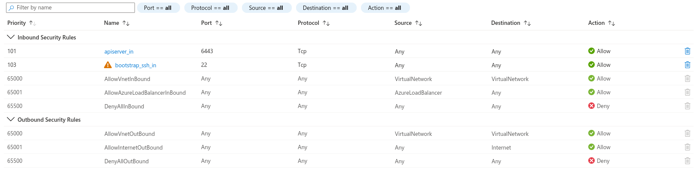
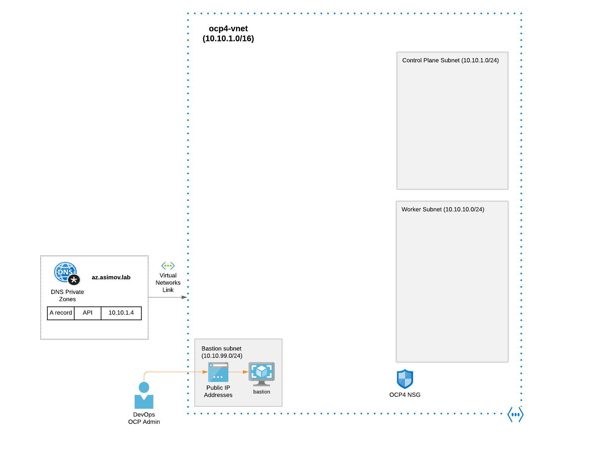

# Prerequisites for Restricted (Privated / Disconnected) Installation in Azure

In an installation of a Openshift4 in a Preexistent VNets and with Restricted Environment (Private
or Disconnected) some prerequisites needs to be present.

To create a private cluster on Microsoft Azure, you must provide an existing private VNet and
subnets to host the cluster.

The installation program must also be able to resolve the DNS records
that the cluster requires. The installation program configures the Ingress Operator and API server
for only internal traffic.

## [User-Defined Outbound Routing](https://docs.openshift.com/container-platform/4.7/installing/installing_azure/installing-azure-private.html#installation-azure-user-defined-routing_installing-azure-private)

In OpenShift Container Platform, you can choose your own outbound routing for a cluster to connect to the Internet. This allows you to skip the creation of public IP addresses and the public load balancer.

You can configure user-defined routing by modifying parameters in the install-config.yaml file before installing your cluster. A pre-existing VNet is required to use outbound routing when installing a cluster; the installation program is not responsible for configuring this.

## [Requirements for using your VNet](https://docs.openshift.com/container-platform/4.7/installing/installing_azure/installing-azure-private.html#installation-about-custom-azure-vnet-requirements_installing-azure-private)

When you deploy a cluster by using an existing VNet, you must perform additional network configuration before you install the cluster.

In installer-provisioned infrastructure clusters, the installer usually creates the following components, but it does not create them when you install into an existing VNet:

* Subnets
* Route tables
* VNets
* Network Security Groups

The cluster must be able to access the resource group that contains the existing VNet and subnets.
Some cluster Operators must be able to access resources in both resource groups.

You must provide two subnets within your VNet, one for the control plane machines and one for the compute machines.

Because Azure distributes machines in different availability zones within the region that you specify, your cluster will have high availability by default.

To ensure that the subnets that you provide are suitable, the installation program confirms the following data:

* All the subnets that you specify exist.
* You provide two private subnets for each availability zone.
* The subnet CIDRs belong to the machine CIDR that you specified. Machines are not provisioned in availability zones that you do not provide private subnets for.

## [Network security group requirements](https://docs.openshift.com/container-platform/4.7/installing/installing_azure/installing-azure-private.html#installation-about-custom-azure-vnet-nsg-requirements_installing-azure-private)

The network security groups for the subnets that host the compute and control plane machines require specific access to ensure that the cluster communication is correct. You must create rules to allow access to the required cluster communication ports.

The network security group rules must be in place before you install the cluster. If you attempt to install a cluster without the required access, the installation program cannot reach the Azure APIs, and installation fails.

```
Port - Description
80     Allows HTTP traffic
443    Allows HTTPS traffic
6443   Allows communication to the control plane machines
22623  Allows communication to the machine config server
```



## Diagram for Prerequites in Azure



Before launch the installation, need to be created these prerequisites:

- 1 VNet
- 1 Private DNS Zone
- 1 Virtual Private Link to link Private Hosted Zone and VNet
- 3 Subnets (1 for Masters, 1 for Workers, 1 for Bastion)
- 1 Bastion (optional) + 1 IP Public to reach
- 1 Network Security Group (?? To Check)

## Automation for deploy this prereqs
